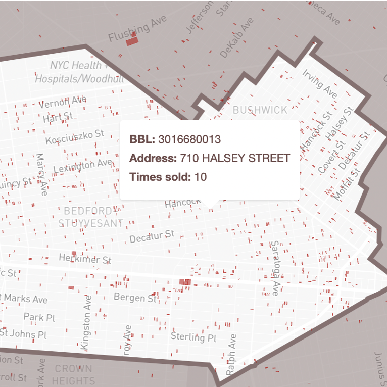
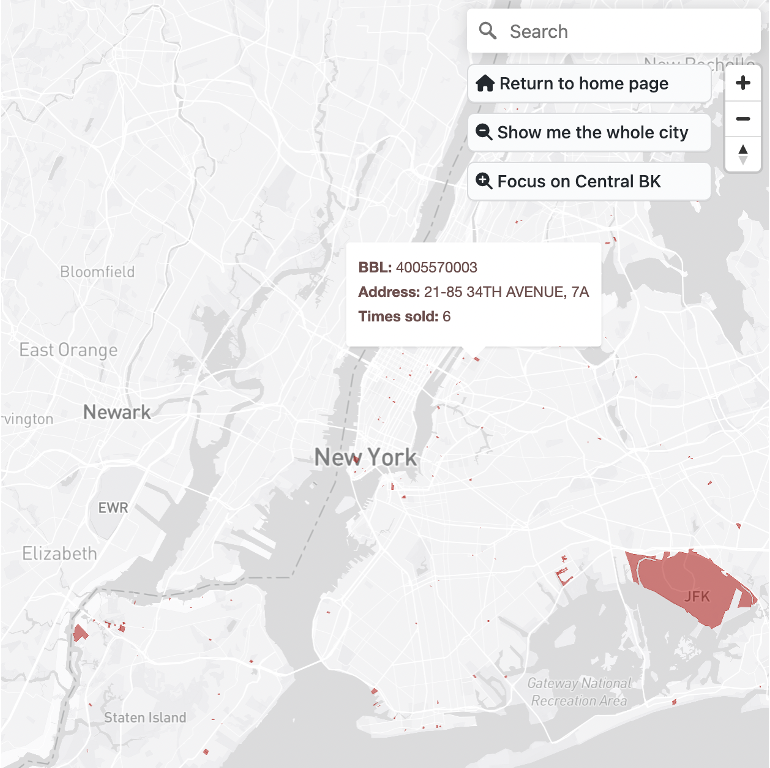

# Real estate flipping in Central Brooklyn (2003 - 2030)
This map shows properties that have been sold 5+ times over the last three decades. It focuses on the Central Brooklyn neighborhoods of Bed-Stuy, Bushwick, Crown Heights, and Ocean Hill because they rank highest in number of flipped properties and contain 28% of NYC's most-sold properties altogether. 

 

## How to use this map
- Frequently-sold properties are highlighted in red. 
- Hover over a red, highlighted lot to view the Borough-Block-Lot (BBL) ID and address of the frequently-sold property that sits on it, as well as the number of times it has been sold since 2003.
- Click on the lot to view its sales history and more details about the property.
- If you would like to view frequently-sold properties outside Central Brooklyn, search for a specific address or toggle to a view of the entire city using the navigation buttons on the top-right.

  

## Data sources
- Property sales data is from the [NYC Department of Finance Annualized Sales](https://www.nyc.gov/site/finance/taxes/property-annualized-sales-update.page).
- Tax lot outlines are from [NYC PLUTO](https://www.nyc.gov/site/planning/data-maps/open-data/dwn-pluto-mappluto.page).
- Neighborhood Tabulation Areas used to define the Central Brooklyn neighborhoods that this map focuses on are from [BYTES of the BIG APPLE™](https://www.nyc.gov/site/planning/data-maps/open-data.page).

## Lessons learned
Challenges:
- Text
- Text
- Text

Opportunities for further exploration:
- Text
- Text
- Text
