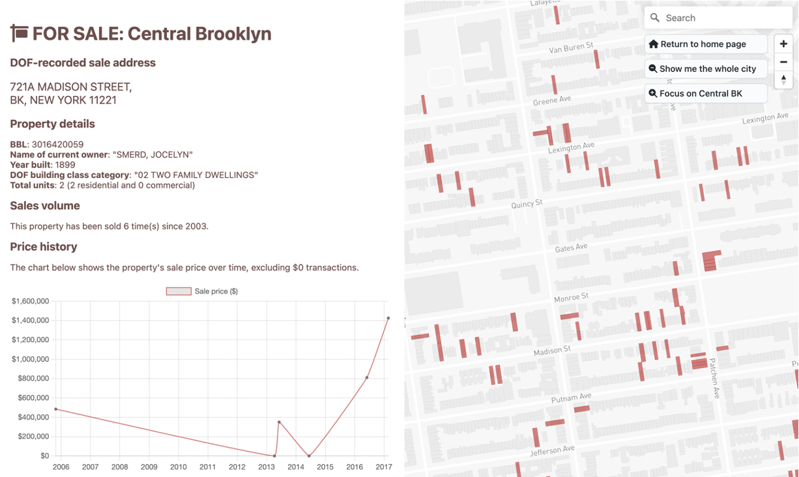
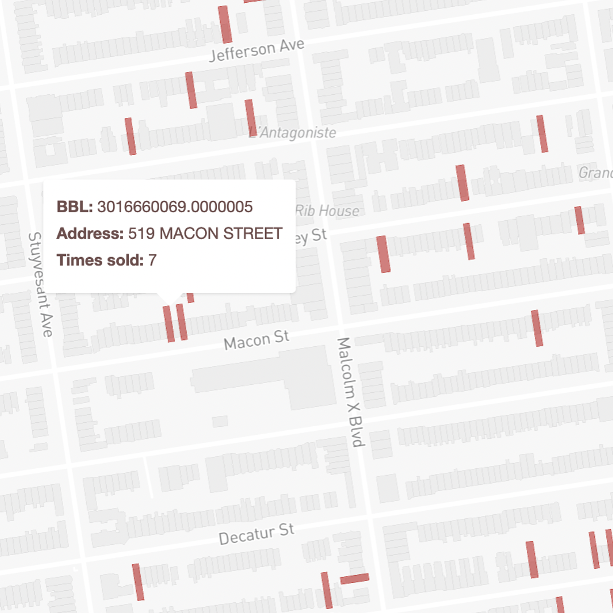
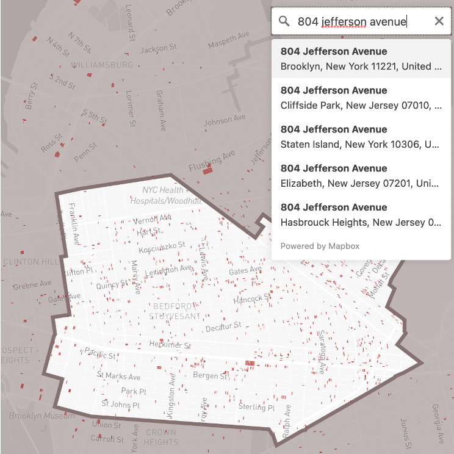
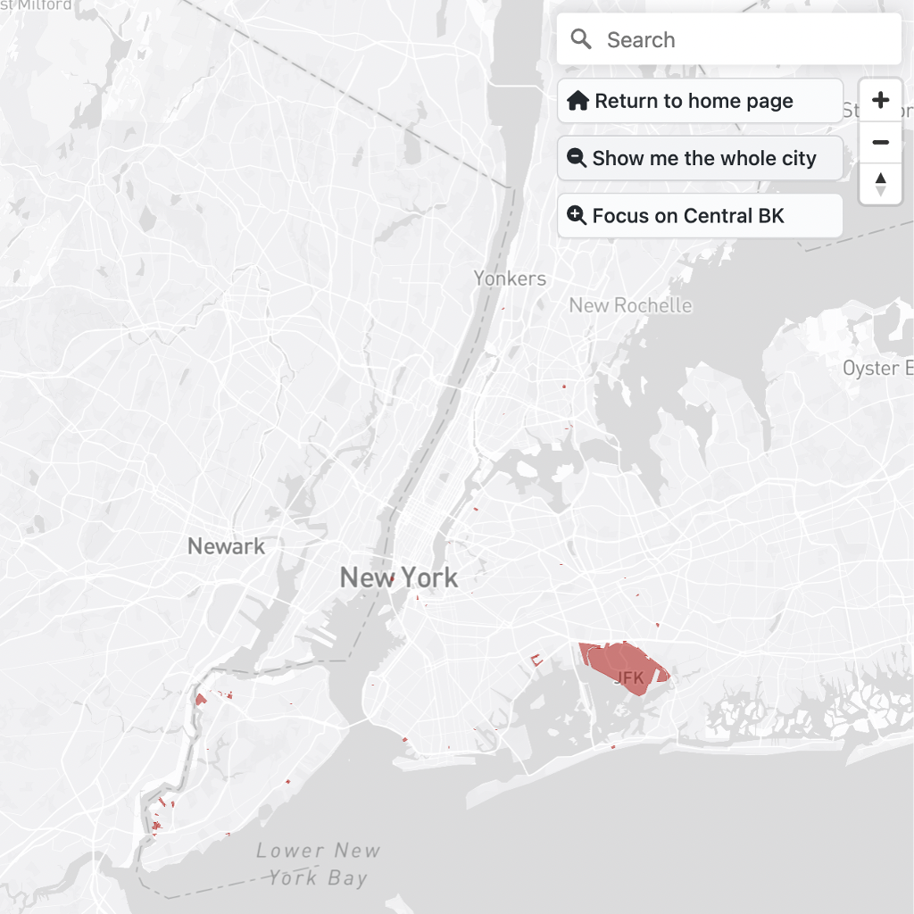

# FOR SALE: Central Brooklyn
Central Brooklyn contains the greatest concentration of frequently sold or "flipped" properties in NYC. Together, Bed-Stuy, Bushwick, Crown Heights, and Ocean Hill contain 28% of all NYC properties that were sold 5+ times over the last three decades (from 2003 to 2023). This map invites users to think about the drivers behind the frequency and price at which these properties are sold and what these sales have meant for owners and residents by exploring data on flipped properties.

*Sample property profile*
 

## How to use this map
- Frequently-sold properties are highlighted in red. 
- Hover over a red, highlighted lot to view the Borough-Block-Lot (BBL) ID and address of the frequently-sold property that sits on it, as well as the number of times it has been sold since 2003.
- Click on the lot to view its sales history and more details about the property.
- If you would like to view frequently-sold properties outside Central Brooklyn, search for a specific address or toggle to a view of the entire city using the navigation buttons on the top-right.

  

## Data sources
- Property sales data is from the [NYC Department of Finance Annualized Sales](https://www.nyc.gov/site/finance/taxes/property-annualized-sales-update.page).
- Tax lot outlines are from [NYC PLUTO](https://www.nyc.gov/site/planning/data-maps/open-data/dwn-pluto-mappluto.page).
- Neighborhood Tabulation Areas used to define the Central Brooklyn neighborhoods that this map focuses on are from [BYTES of the BIG APPLE™](https://www.nyc.gov/site/planning/data-maps/open-data.page).

## Map-mapping takeaways
Lessons learned:
- **Condensing information:** My first draft displayed a table of sales data rather than a chart. The table was difficult to create and format, and overwhelming to interpret. I sought advice from [@chriswhong](https://github.com/chriswhong), who directed me to try the chart.js package. It was remarkably easy to use and allowed me to display sales history in a way that didn't overwhelm the viewer.
- **Creating a responsive website layout:** Building on @chriswhong's [responsive web layout template](https://github.com/chriswhong/responsive-web-map-layout/tree/main), I designed this site to split the screen space between the map and data panel 50/50. While this looks simple, it took me many tries to display the map, data panel, and buttons in the sequence I wanted.

Challenges:
- **Interpreting sales patterns:** My first draft focused on Jackson Heights because it was an area that my initial data analysis flagged as a hotsplot for real estate sales. Turns out, I was counting all coop sales against the buildings they were in, resulting in concentrations of flipping in locations with concentrations of coops. I adjusted my data processing methodology to look for sales with the same address after that, as DOF annualized sales data includes unit numbers in addresses. This was an error I only caught by previewing my map to a coworker who'd worked for a large multifamily landlord and lived in coops growing up. As someone less familiar with real estate sales processes, it's hard for me to check my methodology against real-life sales practices and to interpret sales patterns.
- **Data processing workflow:** My data processing workflow was long and hard to replicate. I processed DOF sales data for most-flipped properties locally in R Studio and then uploaded the most-flipped properties to VS Studio where I converted the csv data from R into JSON format. Every time I changed my locational focus, I downloaded Neighborhood Tabulation Area polygons locally from BYTES of the BIG APPLE™, selected the ones I wanted in QGIS, and then exported them as geoJSONs to display in the map. Both these workflows are manual, time-consuming, and prone to error with repetition.

Opportunities for further exploration:
- **Data exploration:** This map asks the viewer to explore sales data and come to their own conclusions. When I began this project, I was hoping to present stronger takeaways to the viewer on drivers of or patterns within sales data. While I'm happy to present the location where flipping is most rampant, I think an important next step could be to explore this data in R or another data processing tool to understand why sales are occurring at this frequency and at these prices in Central Brooklyn. 
- **Adding narrative:** Quantitative analysis of the sales data can yield insights on sales patterns, but only qualitative data from interviews, reports, or news media can really bring this data to life. Just like my coworker elucidated me to why "flipping" was concentrated in Jackson Heights, discussing this data with people familiar with Central Brooklyn and real estate transactions can demystify this map.
- **Adding imagery:** I originally wanted to create a narrative storymap with images of buildings and timelines of their sales histories. Instead, I've created more of a dashboard of sales data for properties in NYC. I'd like to link to Google Street View images, but their API is not free. An alternative could be adding imagery for specific properties or locations that have particularly illustrative or interesting sales histories like callouts on a site-seeing map. 

